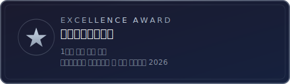
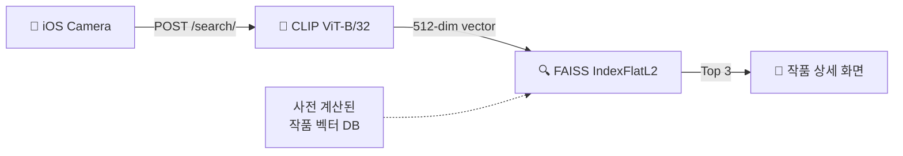
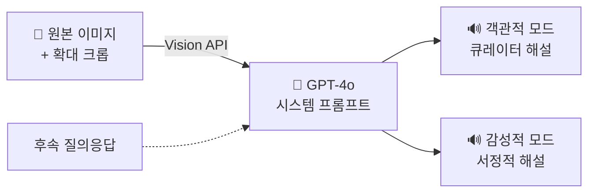
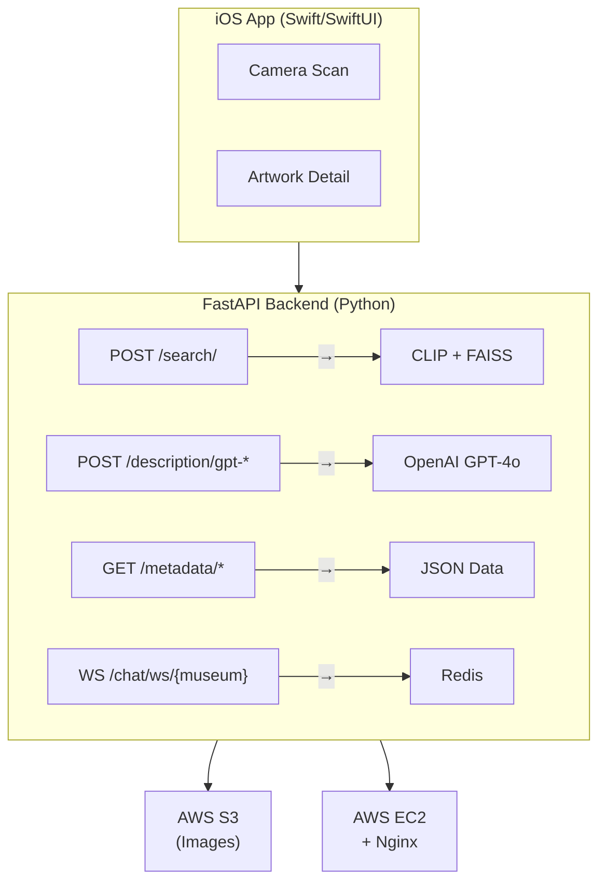

# 시각장애인 전시 감상 보조 앱 눈와:


> AI-powered iOS app enabling blind and low-vision museum visitors to independently explore exhibitions through LLM-generated audio descriptions and interactive artwork zoom

[](https://apps.apple.com/kr/app/%EB%88%88%EC%99%80/id6670430511)
[](https://www.youtube.com/watch?v=5qsIBKE3kAk)

<p>
  
  
</p>

## 주요 기능

### 1. 전시관별 작품 목록 및 설명 제공

전시관 정보와 작품 메타데이터(제목, 작가, 기법, 감정)를 제공합니다. 정렬 옵션을 통해 작품을 탐색할 수 있습니다.

### 2. 카메라 작품 인식 (CLIP + FAISS)

카메라로 작품을 촬영하면 CLIP ViT-B/32 모델로 512차원 특징 벡터를 추출하고, FAISS 벡터 유사도 검색으로 등록된 작품 중 상위 3개를 매칭합니다. 전시 모드와 자유 촬영 모드를 지원합니다.

### 3. AI 해설 (GPT-4o)

두 가지 해설 모드를 제공합니다:

- **객관적 모드**: 미술관 큐레이터 관점의 사실적, 구조적 해설 (영어)
- **감성적 모드**: 감정 중심의 서정적 해설 (한국어)

작품의 특정 영역을 확대 캡처하여 원본 이미지와 함께 GPT-4o Vision API로 전송하며, 후속 질의응답도 지원합니다.

### 4. 인터랙티브 작품 확대

핀치 줌으로 작품의 세부 영역을 확대하고, 확대된 영역의 스크린샷을 캡처하여 AI 해설을 요청할 수 있습니다.

### 5. 실시간 감상평 채팅

WebSocket 기반 전시관별 실시간 채팅을 지원합니다. Redis로 메시지를 관리하고, APScheduler로 24시간 단위 메시지 아카이빙을 수행합니다. 익명 사용자 식별자를 통해 프라이버시를 보장합니다.

### 6. 접근성 (VoiceOver)

앱 전체에 VoiceOver 레이블, 힌트, 트레잇을 구현하여 전맹 시각장애인이 독립적으로 앱을 조작할 수 있습니다. UI는 사용자 피드백을 반영하여 v1.0 → v2.0 → v3.0까지 3회 이터레이션을 거쳤습니다.

---

## 핵심 기술 상세

### 작품 인식 파이프라인



### AI 해설 시스템



---

## 시스템 아키텍처



---

## 기술 스택

**Client**


**Backend**


**Infra & Deploy**


**Tools**


### iOS Client

| 항목            | 기술                          |
| --------------- | ----------------------------- |
| Language        | Swift                         |
| UI Framework    | SwiftUI + UIKit               |
| Architecture    | MVVM                          |
| Networking      | Alamofire                     |
| Image Loading   | Kingfisher                    |
| Image Zoom      | SwiftUIImageViewer2           |
| Web View        | BetterSafariView              |
| Accessibility   | VoiceOver / Accessibility API |
| TTS             | AVFoundation                  |
| BLE             | CoreBluetooth                 |
| Package Manager | CocoaPods                     |

### Backend

| 항목              | 기술                |
| ----------------- | ------------------- |
| Framework         | FastAPI (Python)    |
| AI Model          | OpenAI GPT-4o       |
| Image Recognition | CLIP (ViT-B/32)     |
| Vector Search     | FAISS (IndexFlatL2) |
| Storage           | AWS S3 (boto3)      |
| Real-time         | WebSocket           |
| Cache             | Redis               |
| Scheduler         | APScheduler         |
| Image Processing  | Pillow, OpenCV      |

### Web Frontend

| 항목           | 기술             |
| -------------- | ---------------- |
| Styling        | Tailwind CSS     |
| Real-time Chat | WebSocket        |
| Image Zoom     | mouse-wheel-zoom |

### Infrastructure

| 항목          | 기술                                       |
| ------------- | ------------------------------------------ |
| Hosting       | AWS EC2                                    |
| Storage       | AWS S3                                     |
| Reverse Proxy | Nginx                                      |
| CI/CD         | GitHub Actions (main push → EC2 자동 배포) |

---

## 프로젝트 구조

```
eyeson/
├── .github/
│   └── workflows/
│       └── aws.yml                     # CI/CD: main push → EC2 자동 배포
├── backend/
│   ├── main.py                         # FastAPI 앱 진입점
│   ├── routers/
│   │   ├── search_router.py            # CLIP + FAISS 이미지 유사도 검색
│   │   ├── description_router.py       # GPT-4o 작품 해설 생성
│   │   ├── metadata_router.py          # 전시/작품 메타데이터 조회
│   │   └── chat_router.py             # WebSocket 실시간 채팅
│   ├── services/
│   │   ├── cnn_service.py              # CLIP ViT-B/32 특징 벡터 추출
│   │   ├── faiss_service.py            # FAISS 벡터 유사도 검색
│   │   ├── openai_service.py           # GPT-4o API 통합
│   │   ├── s3_service.py               # AWS S3 이미지 관리
│   │   └── image_service.py            # 이미지 포맷 유틸리티
│   ├── data/                           # 전시/작품 JSON 메타데이터
│   └── static/                         # 웹 프론트엔드 (채팅 UI)
│       ├── index.html
│       ├── artChat.html
│       └── chatstyle.css
└── ios-client/
    ├── eyeson/
    │   ├── eyesonApp.swift             # 앱 진입점
    │   └── ContentView.swift           # 탭 네비게이션
    ├── Features/
    │   ├── Exhibits/                   # 전시관 목록
    │   ├── ExhibitsDetail/             # 전시관 상세
    │   ├── Artwork/                    # 작품 상세 + AI 해설
    │   ├── ArtworkDetail/              # 작품 확대 (UIKit ScrollView)
    │   ├── Camerascan/                 # 카메라 촬영 + 작품 검색
    │   ├── FreeCameraMode/             # 자유 촬영 + AI 해설
    │   ├── BluetoothScan/              # BLE 비콘 스캔
    │   └── Settings/                   # 설정 (AI 모드, 권한)
    ├── Utils/                          # 권한 관리, 위치 유틸리티
    └── Podfile                         # CocoaPods 의존성
```

---

## API 명세

| Method      | Endpoint                              | 설명                                                                 |
| ----------- | ------------------------------------- | -------------------------------------------------------------------- |
| `POST`      | `/search/`                            | 촬영 이미지와 등록 작품 간 유사도 검색 (CLIP + FAISS, 상위 3개 반환) |
| `POST`      | `/description/get-origin/`            | 등록 작품의 원본 메타데이터 및 S3 URL 조회                           |
| `POST`      | `/description/gpt-artwork/`           | 등록 작품의 확대 영역에 대한 AI 해설 생성 (원본 + 크롭 이미지)       |
| `POST`      | `/description/gpt-nonartwork/`        | 미등록 이미지에 대한 AI 해설 생성                                    |
| `POST`      | `/description/gpt-nonartwork-prompt/` | 이미지에 대한 사용자 질의응답                                        |
| `GET`       | `/metadata/with-images/`              | 전시관별 작품 목록 조회 (이미지 URL 포함)                            |
| `GET`       | `/metadata/exhibit-info/`             | 전시 정보 조회                                                       |
| `WebSocket` | `/chat/ws/{museum}`                   | 전시관별 실시간 감상평 채팅                                          |
